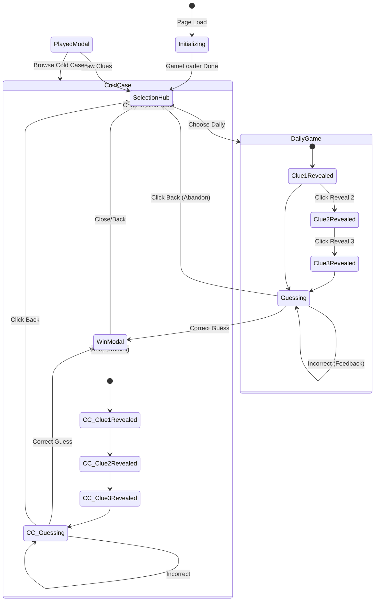

# 🎮 Snoo-Clues UI State Machine

This diagram represents the valid transitions between UI states in the Snoo-Clues application.

## State Descriptions

- **Initializing**: GameMaker engine loading (z-index 2000).
- **SelectionHub**: Entry point for picking a case file (z-index 1000).
- **DailyGame / ColdCase**: The main investigation notebook (z-index 100).
- **WinModal**: Mystery solved celebration (z-index 1000).
- **PlayedModal**: Displayed if the daily puzzle was already completed.
- **Abandon (Confirm)**: Confirmation dialog when attempting to leave an active investigation.
